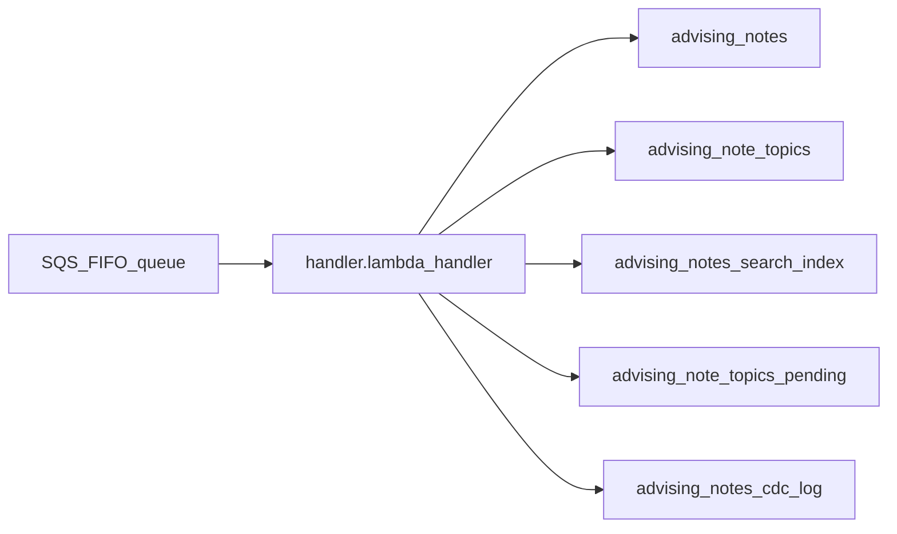

# Architecture

Production CDC path: **SQS FIFO → Lambda → PostgreSQL** (`boa_app_rds_direct`).

The parent Searchlight repo also evaluates a delta/nightly write path; this pack is **direct only**.

## Data flow

```text
BOA (source of truth)
  → SQS FIFO (CDC events)
  → handler.lambda_handler
  → boa_app_rds_direct (notes, topics, FTS, CDC log)
```



## Goals

- Fewer writes per event (~2–3 vs delta/nightly)
- One live table per entity
- CDC audit trail in Postgres for replay after bulk refresh

## Handler entry

```python
# lambda/handler.py
handler.lambda_handler  →  process_message
```

Environment variables (set by Terraform or `env.json`):

| Variable | Purpose |
|----------|---------|
| `DB_SECRET_NAME` / `DB_NAME` | RDS credentials (production) |
| `DB_HOST`, `DB_PORT`, `DB_USER`, `DB_PASSWORD` | Local dev credentials |
| `LOCAL_DEV` | `"true"` for local Postgres; `"false"` for Secrets Manager |
| `RDS_SCHEMA_BOA_APP_RDS_DATA` | Target schema (default `boa_app_rds_direct`) |
| `HANDLER_VERSION` | Logged in CDC audit (e.g. `direct-v1`) |

## Schema: `boa_app_rds_direct`

SQL: `sql/001_schema.sql` through `003_indexes.sql`.

| Table | Purpose |
|-------|---------|
| `advising_notes` | Live notes (seeded from nightly export) |
| `advising_note_topics` | Live topics |
| `advising_notes_search_index` | FTS (`tsvector` + GIN) |
| `advising_note_topics_pending` | Orphan topics before parent note arrives |
| `advising_notes_cdc_log` | Audit: payload, prepared record, status |

Passthrough views (`*_vw`) mirror naming used elsewhere for shadow reads.

## Composite ID strategy

| Field | Meaning | Example |
|-------|---------|---------|
| `id` (PK) | `{sid}-{note_id}` | `9000000000001-900001` |
| `boa_id` | Source note id | `900001` |
| `sid` | Student id | `9000000000001` |

Topics use the parent note's composite `id` plus `topic` as composite PK `(id, topic)`.

## Per-event writes

All operations run in **one transaction** plus an `INSERT` into `advising_notes_cdc_log`.

| Event | Operations |
|-------|------------|
| Note upsert | Upsert `advising_notes` + rebuild FTS |
| Topic upsert/delete | Upsert/delete topic + rebuild FTS |
| Note delete | Delete note, topics, FTS, pending |
| Orphan topic | Park in pending (`apply_status`: `parked`) |

On failure: rollback → `batchItemFailures` → SQS message **not** deleted.

## CDC audit log

| Column | Description |
|--------|-------------|
| `event_id` | SQS `messageId` (unique) |
| `table_name`, `operation`, `effective_operation` | Raw + normalized op |
| `boa_id`, `composite_id` | Source / derived IDs |
| `payload` | Raw CDC `row` (JSONB) |
| `prepared_record` | Mapped DB payload (JSONB) |
| `apply_status` | `applied`, `parked`, `partial_warning` |
| `handler_version` | e.g. `direct-v1` |

Failures that roll back the transaction are **not** logged in-table; use CloudWatch + DLQ.

| `apply_status` | Meaning |
|----------------|---------|
| `applied` | Committed successfully |
| `parked` | Orphan topic waiting for note |
| `partial_warning` | Committed but FTS updated 0 rows |

## Event contract

CDC events arrive on **SQS FIFO** as JSON in the message `body`.

Lambda receives:

```json
{
  "Records": [{
    "messageId": "...",
    "body": "{\"table\":\"notes\",\"operation\":\"create\",\"row\":{...}}"
  }]
}
```

### Payload fields

| Field | Values | Description |
|-------|--------|-------------|
| `table` | `notes`, `note_topics` | Entity type |
| `operation` | `create`, `update`, `delete`, `upsert` | CDC operation |
| `row` | object | Full record from source |

### Delete detection

Treated as **delete** when:

- `operation` is `delete`, **or**
- `row.deleted_at` is non-null

### Notes row (source → DB)

| Source (`row`) | Destination column |
|----------------|-------------------|
| `id` + `sid` | composite `id` |
| `id` | `boa_id` |
| `author_uid` | `advisor_uid` |
| `author_name` | `author_name` (+ parsed first/last) |
| `body` | `note_body` |
| `subject` | `subject` |

### Topics row

Topics include `note_id` (maps to `boa_id`) and `topic`. Composite `id` and `sid` are resolved by looking up the parent note.

### Idempotency

All handlers use upsert/delete by primary key. Replaying the same SQS message is safe. The audit log uses `ON CONFLICT (event_id) DO UPDATE`.

Synthetic examples: `events/examples/` (see `events/examples/README.md`).

## Full-text search

PostgreSQL **`tsvector`** + **GIN** index. One FTS row per note (`id` = composite note id).

### Index formula

```text
to_tsvector('english',
  subject + ' ' + note_body + ' ' + aggregated_topics + ' ' + author_name)
```

- Topics: `STRING_AGG(topic, ' ' ORDER BY topic)` for the note
- Empty fields become `''` via `COALESCE`

Implementation: `lambda/handler.py` → `update_fts_index`.

### GIN behavior

- **Insert/upsert** on `fts_index` updates the GIN index incrementally (per row)
- **Delete** removes postings for that row
- No full-table `REINDEX` on each CDC event

### Search examples

```sql
SELECT n.*
FROM boa_app_rds_direct.advising_notes n
JOIN boa_app_rds_direct.advising_notes_search_index s ON n.id = s.id
WHERE s.fts_index @@ plainto_tsquery('english', 'lorem');

-- By student
SELECT n.*
FROM boa_app_rds_direct.advising_notes n
JOIN boa_app_rds_direct.advising_notes_search_index s ON n.id = s.id
WHERE n.sid = '9000000000001'
  AND s.fts_index @@ to_tsquery('english', 'lorem');
```

### Verify GIN usage

```sql
EXPLAIN ANALYZE
SELECT id FROM boa_app_rds_direct.advising_notes_search_index
WHERE fts_index @@ plainto_tsquery('english', 'lorem');
```

Expect a **Bitmap Index Scan** on the GIN index.

## Bulk refresh

When a nightly export reloads base tables, replay CDC from `advising_notes_cdc_log` for events after the export cutoff. See [Operations — Full refresh](operations.md#full-refresh).
